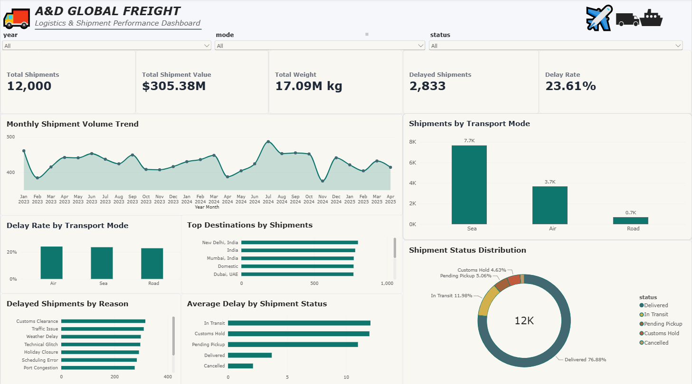

# Logistics & Shipment Performance Analysis



## 📌 Project Overview

This is an end-to-end **Data Analytics portfolio project based on a logistics and freight-forwarding business scenario**.

The project demonstrates how raw shipment data can be **profiled, cleaned, validated, analyzed, and transformed into meaningful business insights** using Python, SQL, Excel, and Power BI.

The analysis focuses on shipment volume, shipment value, shipment weight, transportation modes, delivery status, delays, delay reasons, routes, and destinations.

---

## ⚠️ Important Dataset Disclaimer

**The dataset used in this project is NOT real company data and is NOT proprietary data from A&D Global Freight Pvt. Ltd.**

The dataset is **synthetic/sample data created for educational, portfolio, and demonstration purposes**. It was designed to represent a realistic logistics and freight-forwarding business scenario without using confidential company information.

Any shipment records, customer information, routes, shipment values, dates, operational details, or business metrics present in the dataset are **fictional/sample records** and should not be considered actual company records or actual business performance.

This project is intended solely to demonstrate **Data Analytics skills, tools, techniques, and workflow**.

---

## 🎯 Project Objectives

The main objectives of this project are:

- Understand and profile the shipment dataset.
- Identify missing values, duplicates, and data inconsistencies.
- Perform data quality checks.
- Clean and prepare the dataset for analysis.
- Validate the processed dataset.
- Perform exploratory data analysis using Python.
- Perform basic and advanced SQL analysis.
- Analyze shipment volume, value, and weight.
- Analyze transportation modes and delivery status.
- Analyze shipment delays and delay reasons.
- Analyze routes and destinations.
- Build an interactive Power BI dashboard.
- Convert raw shipment data into meaningful business insights.

---

## 🛠️ Tools & Technologies

| Tool / Technology | Purpose |
|---|---|
| **Python** | Data cleaning, profiling, validation and EDA |
| **Pandas** | Data manipulation and analysis |
| **NumPy** | Numerical operations |
| **SQL / MySQL** | Data querying and analytical analysis |
| **Excel** | Data handling and analysis |
| **Power BI** | Dashboard development and visualization |
| **Git & GitHub** | Version control and project management |

---

## 🔄 Data Analytics Workflow

```text
Raw Shipment Dataset
        ↓
Data Profiling
        ↓
Data Quality Checks
        ↓
Data Cleaning
        ↓
Data Validation
        ↓
Exploratory Data Analysis
        ↓
SQL Analysis
        ↓
Power BI Dashboard
        ↓
Business Insights
